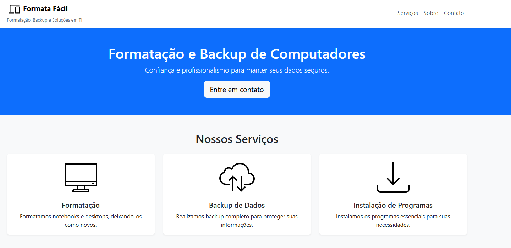

# 💻 Formata Fácil – Site Institucional

Este repositório contém o código-fonte do site institucional desenvolvido como parte da **Atividade Extensionista 2** do curso de Engenharia de Software (2º período), com o objetivo de apoiar um profissional autônomo da área de manutenção de computadores.

## 🔍 Objetivo

Criar um site moderno, responsivo e funcional para apresentar os serviços oferecidos, possibilitar contato com clientes e fortalecer a presença online do negócio.

## 🚀 Tecnologias Utilizadas

- HTML5
- CSS3
- Bootstrap 5
- JavaScript
- GitHub Pages

## 📸 Prévia

## 🌐 Acesse o site

[🔗 Clique aqui para acessar a versão publicada no GitHub Pages](https://ssantiago121.github.io/formata-facil/)  

## 📈 Contribuição para os ODS

A atividade está alinhada ao **ODS 8 – Trabalho Decente e Crescimento Econômico**, ao promover a inclusão digital e o fortalecimento de pequenos negócios locais por meio da tecnologia.

## 📘 Relatório de Desenvolvimento

Acesse o [relatório completo de desenvolvimento](RELATORIO.md) para entender o processo, as etapas, e as ferramentas utilizadas no projeto.

## 👨‍💻 Autor

**Fábio Santiago de Sousa Júnior**  
 - Aluno do Curso de Engenharia de Software da [Gran Faculdade](https://faculdade.grancursosonline.com.br/)
 - Desenvolvido como parte da Atividade Extensionista

---

